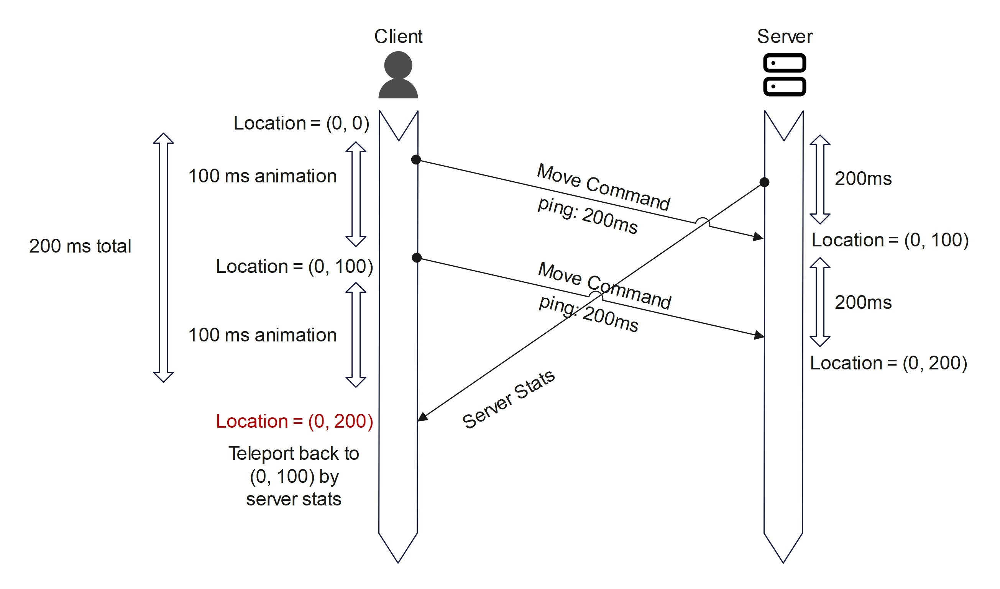
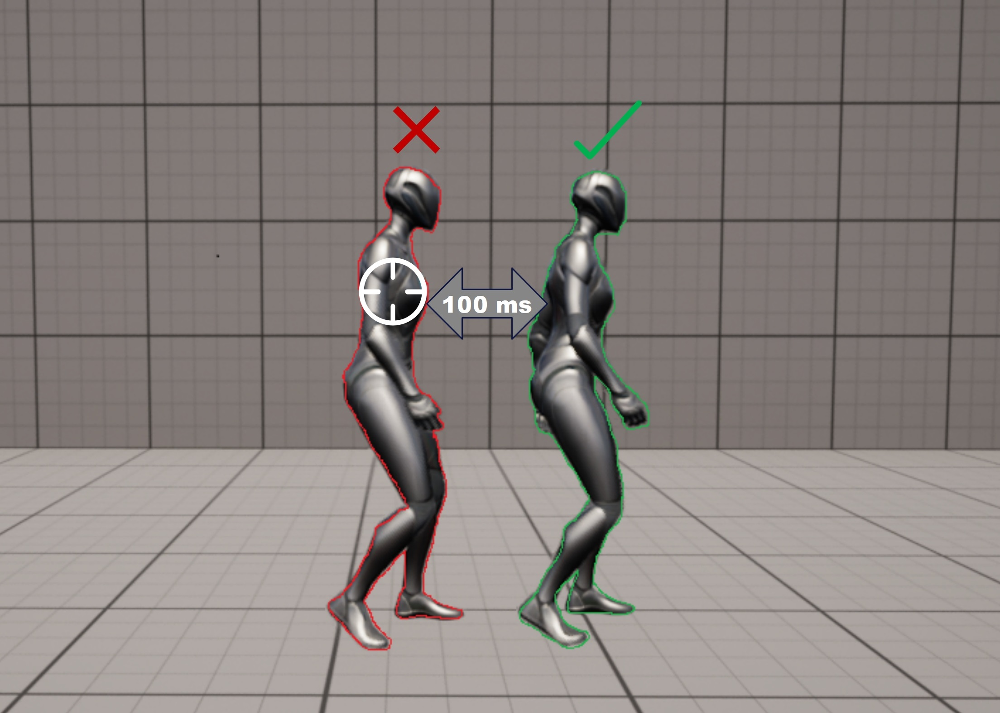

# Secure Multiplayer Game Design

In multiplayer games, we can't simply trust player input because players can cheat. So here's an important rule you always need to remember: **never trust the client**—it can modify every request it sends.

To prevent cheating, the **server** must act as the authority, verifying all actions, while the **client** should be "dumb," meaning it only sends input to the server and waits for the server’s response.

For example, in **Minecraft 1.8**, the client could teleport from location A to B simply by sending the new coordinates to the server. Similarly, a player could break a block just by sending a request telling the server that they had done so, without any real validation.

## Authoritative Server Mode

In the **authoritative server model**, the server is the only source of truth. Players send their actions (such as movement, firing a weapon, etc.), and the server decides the outcome of each action before updating all relevant clients with the data.

For simpler or turn-based games, this approach alone can fully prevent cheating. However, there’s a trade-off: **game responsiveness**. If every input has to be sent to the server and wait for a state update, it introduces noticeable delay.

It may not seem like much, but imagine a player with 100ms ping moving forward. The client sends the movement input to the server, waits for the server to update the position, and then receives the confirmation. Even without any packet loss, the player’s input experiences at least 0.1 seconds of delay, making the game feel unresponsive.

So, if we can’t run logic purely on the client (due to cheating) or only on the server (due to lag), what should we do? You guessed it—**clients predict** each action, and the server corrects it as necessary.

## Client-Side Prediction

A simple example of **client-side prediction** is when a player fires a weapon. The client can immediately play the firing animation and sound while simultaneously sending a request to the server to process the shot. The server then validates whether the weapon has enough ammo, performs a line trace to check if the shot actually hit something, and updates all clients with the results.

Another important example is **movement prediction**. Let’s say a player wants to move forward from point A to point B and sends the movement update to the server. The server receives it and updates the state.

Now, what happens if it takes 100ms for the player to move from A to B, but the player has 200ms ping?

1. The player sends the movement request to the server at 0ms and moves forward immediately.
2. After 100ms, the player reaches point B, but the server still hasn’t received the update due to the 200ms round-trip delay.
3. The player continues moving forward to point C, taking another 100ms (200ms total).
4. Meanwhile, the server finally receives the movement request and updates the player’s position from A to B, then sends this state update back to the client.
5. Now the client expects to be at C, but the server says the player is at B, causing **rubberbanding**—the player gets teleported back to B because the server has authority.

An important thing to note here is that the server is always in the past relative to the client, delayed by at least the player's ping (in this case, 200ms).

### Solving Rubberbanding with Request IDs

A simple way to fix this issue is by using **request IDs**. Let’s say the client sends:

- **Request #1:** Move from A → B
- **Request #2:** Move from B → C

When the server receives **Request #1** and updates the state, the client knows this request has been accepted. Instead of teleporting the player back to B, the client simply waits for **Request #2** to also be validated, allowing smooth movement while still ensuring server authority.

## Lag Compensation

Now that we know the server is in the past, what happens if a player with 100ms ping aims and shoots at an opponent? They miss—because by the time the fire request reaches the server, 100ms later, the target may have already moved. 

This is frustrating for players. The player aimed perfectly at the target, but they still got punished just because of their connection delay.

> [!NOTE]  
> The red character is what the player aims at and sees on their client, and after 100ms, when the shot request reaches the server, the green character is what the server uses to calculate if the shot hits.

### What is Lag Compensation?

In simple terms, **lag compensation** means the server stores a history of the game world. When a player fires a shot, the server rewinds time to the moment the player actually pulled the trigger (from the client’s perspective) and checks if the shot hit anything at that point in time.

This way, players hit what they see, rather than suffering from server delay.

## Conclusion

There's always a trade-off when deciding how to handle data in a multiplayer game. Prioritizing responsiveness might introduce inconsistencies, while enforcing strict server authority can make the game feel unresponsive. Finding the right balance is what makes networking a fun and unique challenge for developers.

I'll be adding some extra links at the end that go more in-depth on each topic, so if you want to learn more, be sure to check them out.
## Useful Links

- [Unreal Engine Architecture Character Movement Component In-Depth by delgoodie](https://www.youtube.com/watch?v=dOkuIvKCvpg)

- [Server In-game Protocol Design and Optimization by Valve](https://developer.valvesoftware.com/wiki/Latency_Compensating_Methods_in_Client/Server_In-game_Protocol_Design_and_Optimization)

